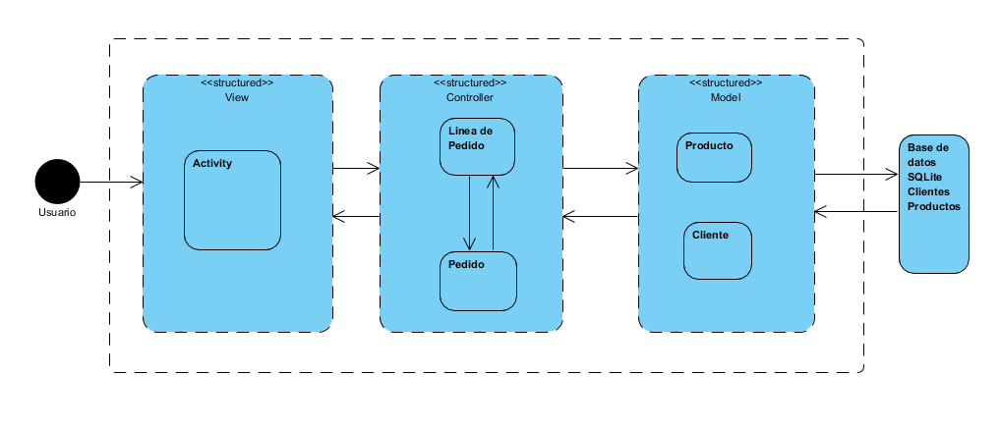

# App Restaurante La Fragua
Restaurante La Fragua App es una aplicación móvil con un sistema operativo Android que está diseñada en el entorno de 
desarrollo de Android Stuido 3.3.1 y desarrollada en el lenguaje de programación de Java 8.

## Primera fase: KickStar, estudio de mercado y prototipado
La selección del tipo de proyecto se centra en dar un valor añadido a un restaurante. Actualmente Restaurante La Fragua 
tiene un mercado centrado únicamente a servicio de comedor enfocado a los fines de semana sin dar servicio entre semana.

El mundo de la hostelería actualmente debería estar orientado a dar servicio en horario ininterrumpido los 365 días del 
año, como toda empresa del mundo de los servicios.

Los hábitos de consumo están cambiando, el cliente no tiene horarios y el futuro está encaminado a las nuevas tecnologías 
cuya revolución en estos últimos años está haciendo que todo esto cambie de manera vertiginosa.

Por lo tanto se puede apreciar que hay un hueco de mercado sin explotar en esta empresa: 
* Por un lado los horarios en los que no da servicio.
* Sólamente tiene servicio de comedor, pero no tiene servicio de fastfood.
* No tiene presencia en internet.
* Y lo más importante que su clientela reclama todo esto y además que ofrece comida de calidad.

Todo esto es los aspectos principales pero [observando esta presentación del proyecto](Presentacion/PresentacionAppRestLaFragua.pptx) se puede ver con
más detalle el análisis de todo este estudio.

### Redacción de la lista de requisitos.
App Restaurante La Fragua va a ser una aplicación móvil de pedido a domicilio. El usuario por lo tanto podrá acceder a una
oferta culinaria del restaurante, añadirla al carro de compra y efectuar el pago. Por lo tanto la aplicación constará de las
siguientes funcionalidades:
* Oferta de varios tipos de productos con opción siempre de ampliar, variar o reducir la oferta. Básicamente productos 
que diferencien de la competencia: tortillas, hamburguesas especiales etc.
* Dará la opción al usuario de generar un carro de la compra.
* Aplicará la funcionalidad de pago con tarjeta vía paypal.
* Generará clientes que se guardarán en una base de datos.

### Prototipado
Para abordar con éxito este proyecto se ha elaborado una estructura de trabajo para que sea
una aplicación técnica y funcionalmanete hablando, apropiada para los requerimientos del restaurante:

* Ante todo se ha apostado por una App sencilla, directa, sin intermediarios y orientada únicamente a comida rápida pero
centrándonos también en otros productos que no sean siempre hamburguesas. Esto va a dar valor añadido a la App porque según
estudios de mercado el 95% de este tipo de Apps están orientadas a hamburguesas.
* Centrándonos en la técnología de la aplicación se quiere seguir unas directrices de programación orientada a objetos y 
se han diseñado el siguiente diagrama de clases y el diagrama de actividad.

***Diagrama de clases***

***Diagrama de actividad***

* Atendiendo al aspecto visual, la interfaz de usuario ha de ser sencilla, asequible para el usuario y funcional. Un ejemplo
de interfaz podría ser la siguiente:

No obstante se podría tener en cuenta el siguiente prototipo creado con [Justinmind Prototyper](https://www.justinmind.com/).
[Ver funcionamiento prototipo ](Prototipos/Prototipado.vp).

* Este tipo de App va a requerir de una persitencia de datos donde poder almacenar toda la información necesaria para el
correcto funcionamiento de la misma. Se ha pensado en trabajar con Sqlite o Firebase. Según el desarrollo se optará por una 
u otra tecnología.

## Segunda fase: Desarrollo técnico de la aplicación, entrenamientos.

Desarrollados y estudiados estos aspectos técnicos se procederá al tabajo en el entorno de desarrollo donde se plasmará 
toda la arquitectura planteada. No obstante se debe tener en cuenta que se irán tomando decisiones sobre la marcha lo cual 
puede implicar pequeños cambios en el planteamiento, pero siempre siguiendo las directrices estudiadas desde el principio. 

## Tercera fase: Reto.
Una vez realizadas todas las pruebas técnicas se procederá al desarrollo unificado de todo el trabajo de pruebas y entrenamientos
realizados en la fase anterior. El objetivo es crear la aplicación final en base a toda la estructura de proyecto creada.

## Metodología de trabajo

| Fechas     | Fase a desarrollar   | Trabajos específicos |
| :---------: |:---------------------: | :----------------------:|
| Marzo 26 | Primera: KickStar | Selección propuesta, lista de requisitos, bocetos, prototipado, presentación    |
| Abril 2/16 | Segunda: entrenamientos   | Desarrollo de las pruebas en el entorno de desarrollo  |
| Junio 4 | Tercera: reto | Desarrollo de la aplicación   |

## Enlaces de interés

[Web Restaurante La Fragua](https://www.restaurantelafragua.com/)

[Google Sites Restaurante La Fragua](https://sites.google.com/view/restaurantelafragua/p%C3%A1gina-principal?authuser=0)

